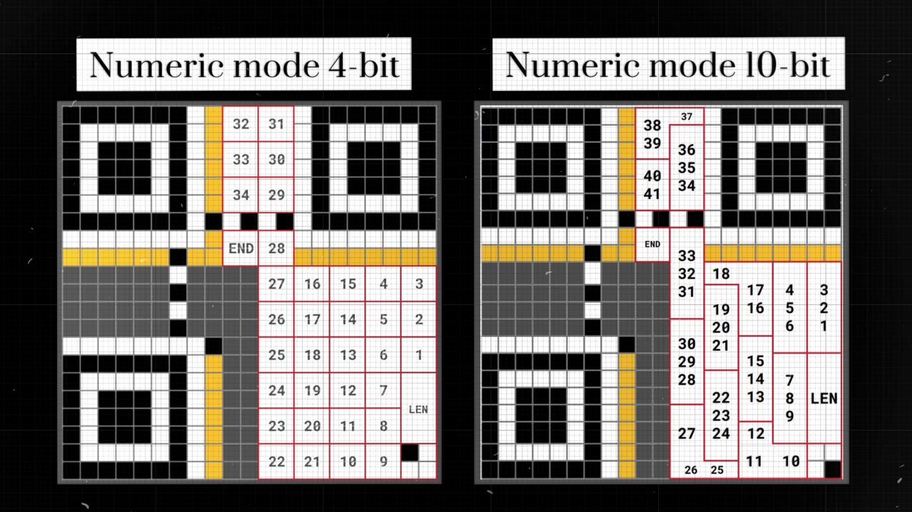


## QR first version

The ISO 18004 Standard is like a guidebook for QR codes. It's 126 pages long and tells us how QR codes are made.

I am creating the First Version of the QR code, it’s the simplest one, and its matrix consists of 21 by 21 modules. The other versions are bigger, so it’s harder to show them on a small screen.

There is also a Micro-QR version, which is really cool, but almost none of the QR-code scanner apps could read them.

## Patterns
---
### Finder patterns

Now, the square doesn’t have any properties that would help distinguish the top from the bottom and determine that it is a QR code that we see and not a grid paper. So let there be **finder patterns** in three corners. That way we can always orient the QR-code the right way, no matter what angle it was shot from. The finder patterns always occupy 8 by 8 modules in these corners.

### Timing Patterns

The next problem is that there are no grids on real QR codes. Without them, it's hard to tell where each module is. Therefore, to help the scanner distinguish the columns and the rows from each other, we need so-called **timing patterns**. These consist of lines of alternating dark and light modules that connect the finder patterns, plus one dark module situated close to the bottom-left finder pattern, and they help to distinguish between rows and columns.

### Additional Information

Finally, strips of modules with a thickness of one are reserved by now for **additional information.**

## Modes of Encoding
---

All these elements, from search patterns to timing patterns, can be found in any QR code. A message is written into the rest of the modules by painting some of them black. But why use black cells instead of letters?

There are actually 4 main alphabets or modes of encoding that can be used:

- Numeric
- Alphanumeric
- Byte
- Kanji

So before writing our message, we need to specify the method of encoding that we use. For this, the first four modules in the bottom right corner of the QR code are assigned. By choosing one of the modes, we are painting the corresponding module black.

Let's start with the **byte mode** to understand the basics. This alphabet contains 256 different symbols from a specified character set (ISO/IEC 8859-1). Small and capital letters, numbers, punctuation marks, and anything else you might need to write a message.

<b>See ISO/IEC 8859-1 table</b>

 

|     |     |     |     |     |     |     |     |     |     |     |     |     |     |     |     |
| --- | --- | --- | --- | --- | --- | --- | --- | --- | --- | --- | --- | --- | --- | --- | --- |
| 0   | NUL | 32  |     | 64  | @   | 96  | `   | 128 |     | 160 |     | 192 | À   | 224 | à   |
| 1   | SOH | 33  | !   | 65  | A   | 97  | a   | 129 |     | 161 | ¡   | 193 | Á   | 225 | á   |
| 2   | STX | 34  | "   | 66  | B   | 98  | b   | 130 |     | 162 | ¢   | 194 | Â   | 226 | â   |
| 3   | ETX | 35  | #   | 67  | C   | 99  | c   | 131 |     | 163 | £   | 195 | Ã   | 227 | ã   |
| 4   | EOT | 36  | $   | 68  | D   | 100 | d   | 132 |     | 164 | ¤   | 196 | Ä   | 228 | ä   |
| 5   | ENQ | 37  | %   | 69  | E   | 101 | e   | 133 |     | 165 | ¥   | 197 | Å   | 229 | å   |
| 6   | ACK | 38  | &   | 70  | F   | 102 | f   | 134 |     | 166 | ¦   | 198 | Æ   | 230 | æ   |
| 7   | BEL | 39  | '   | 71  | G   | 103 | g   | 135 |     | 167 | §   | 199 | Ç   | 231 | ç   |
| 8   | BS  | 40  | (   | 72  | H   | 104 | h   | 136 |     | 168 | ¨   | 200 | È   | 232 | è   |
| 9   | HT  | 41  | )   | 73  | I   | 105 | i   | 137 |     | 169 | ©   | 201 | É   | 233 | é   |
| 10  | LF  | 42  | *   | 74  | J   | 106 | j   | 138 |     | 170 | ª   | 202 | Ê   | 234 | ê   |
| 11  | VT  | 43  | +   | 75  | K   | 107 | k   | 139 |     | 171 | «   | 203 | Ë   | 235 | ë   |
| 12  | FF  | 44  | ,   | 76  | L   | 108 | l   | 140 |     | 172 | ¬   | 204 | Ì   | 236 | ì   |
| 13  | CR  | 45  | -   | 77  | M   | 109 | m   | 141 |     | 173 | ­   | 205 | Í   | 237 | í   |
| 14  | SO  | 46  | .   | 78  | N   | 110 | n   | 142 |     | 174 | ®   | 206 | Î   | 238 | î   |
| 15  | SI  | 47  | /   | 79  | O   | 111 | o   | 143 |     | 175 | ¯   | 207 | Ï   | 239 | ï   |
| 16  | DLE | 48  | 0   | 80  | P   | 112 | p   | 144 |     | 176 | °   | 208 | Ð   | 240 | ð   |
| 17  | DC1 | 49  | 1   | 81  | Q   | 113 | q   | 145 |     | 177 | ±   | 209 | Ñ   | 241 | ñ   |
| 18  | DC2 | 50  | 2   | 82  | R   | 114 | r   | 146 |     | 178 | ²   | 210 | Ò   | 242 | ò   |
| 19  | DC3 | 51  | 3   | 83  | S   | 115 | s   | 147 |     | 179 | ³   | 211 | Ó   | 243 | ó   |
| 20  | DC4 | 52  | 4   | 84  | T   | 116 | t   | 148 |     | 180 | ´   | 212 | Ô   | 244 | ô   |
| 21  | NAK | 53  | 5   | 85  | U   | 117 | u   | 149 |     | 181 | µ   | 213 | Õ   | 245 | õ   |
| 22  | SYN | 54  | 6   | 86  | V   | 118 | v   | 150 |     | 182 | ¶   | 214 | Ö   | 246 | ö   |
| 23  | ETB | 55  | 7   | 87  | W   | 119 | w   | 151 |     | 183 | ·   | 215 | ×   | 247 | ÷   |
| 24  | CAN | 56  | 8   | 88  | X   | 120 | x   | 152 |     | 184 | ¸   | 216 | Ø   | 248 | ø   |
| 25  | EM  | 57  | 9   | 89  | Y   | 121 | y   | 153 |     | 185 | ¹   | 217 | Ù   | 249 | ù   |
| 26  | SUB | 58  | :   | 90  | Z   | 122 | z   | 154 |     | 186 | º   | 218 | Ú   | 250 | ú   |
| 27  | ESC | 59  | ;   | 91  | [   | 123 | {   | 155 |     | 187 | »   | 219 | Û   | 251 | û   |
| 28  | FS  | 60  |     | 94  | ^   | 126 | ~   | 158 |     | 190 | ¾   | 222 | Þ   | 254 | þ   |
| 31  | US  | 63  | ?   | 95  | _   | 127 |    | 159 |     | 191 | ¿   | 223 | ß   | 255 | ÿ   |

### Message Length

Let’s see how we can represent some information using it. For example, the 10-letter string **`HELLOWORLD`**. The next 8 modules in the QR-code are allocated to represent the length of our message. Each module is assigned a number equal to a power of two in a specific order. The next step is to paint the corresponding modules, so their sum is equal to the length of the message, in our case, it is 8 and a 2.

### Possible Combinations

Now we are ready to encode characters themselves. How can we use modules to do that?

- 1 module: 2 combinations (black or white) which can represent numbers 0 and 1 or letters A and B.
- 2 modules: We get 4 combinations, representing numbers 0 to 3 or letters A to D.
- 3 modules: This gives 8 combinations.
- 4 modules: We have 16 combinations, which can represent numbers 0 to 15 or letters A to P.

Moreover, if the number of modules that are used to encode one character equals $N$, the number of possible characters equals $2^N$.

$$ 
\text{possible combinations} = 2^N 
$$

### Byte Mode Encoding

To simplify the process of creating a block that corresponds to some number, we assign to each module in a block a number that is equal to a power of two. The sum of the numbers in the modules that are painted black equals the number that the block represents.

> [!QUESTION]+ **Why Powers of Two?** 
> The choice of powers of two is rooted in binary representation, the fundamental language of computers. In binary, everything is represented using only two numbers: 0 and 1. This system is efficient and universal for digital encoding.

In byte-mode, we have 256 possible characters that we can use in our message. So, to be able to represent any character from this sheet, we need 8 modules in a block.

For example:
- If only the modules representing the numbers 64 and 1 are colored black, this block represents the 65th character, which is **A**.
- If all the modules in a block are colored black, it represents the last character in the set — some strange French umlaut **ÿ**.

#### Letter Placement and Encoding

That's why for every character in our message, we are allocating a block of 8 modules in this specific order. Then, we change each character to its corresponding number on the character sheet. This number then tells us which modules to color black in our 8-module block.

#### Zigzag Order and Module Assignment

Each module within a block is assigned a value based on powers of two, but this assignment follows a specific zig-zag order. Once these values are assigned, the next step involves painting the modules. The modules are painted such that their combined value matches the number representing a specific character.

#### Encoding Letters in QR Codes

Let's take the letter **H** as an example:

The letter **H** might be the seventy-second character in the list. To represent the number 72, we break it down into its power of two components: 64 and 8. Thus, in the block representing **H**, the modules corresponding to the values 64 and 8 are painted black.
$$ (H) 72 = 64 + 8 $$
This method ensures that each character in the message is uniquely represented by a combination of black and white modules in its corresponding block. Once we've encoded our entire message, we need a way to show that the message is complete. This is done using a **terminator**, which is simply four white modules in a row.

#### Why Not Always Use Byte Mode?

You might wonder, with byte mode's ability to represent so many characters, why bother with other modes? While byte mode does offer a wide range of characters, it has a limitation. Using byte mode, we can only encode a message up to 17 characters long. We also can't use all the modules, as some are reserved for error correction later on.

**Numeric** and **Alphanumeric** modes offer a more efficient way to encode messages. They use clever encoding methods that let us fit more characters into the same QR code size without making it bigger. This means we can convey longer messages without needing a larger QR code.

### Numeric Mode

Numeric mode is designed specifically for encoding numbers. It's perfect for things like prices, phone numbers, book indexes, or tracking inventory items. In this mode, only the digits 0 through 9 are used.

If we follow the logic we've learned, encoding 10 different symbols (the numbers 0-9) would require at least 4 modules. Why? Because 3 modules can only represent 8 different combinations $2^3 = 8$, which isn't enough for 10 numbers.
$2^4=16$ which is greater than 10. So, 4 modules can represent all 10 numbers with some combinations to spare.

When we divide our modules into blocks of four, we can fit 34 digits using Numeric mode.

#### Numeric vs. Byte Mode

Numeric mode has a greater capacity than if we were using the 256-character alphabet of byte mode. The key takeaway here is simple:

>[!NOTE]+**The fewer characters in our chosen alphabet, the more information we can pack into the same QR code space.**

#### Numeric Mode 4bit

But this approach is not very effective. By choosing to use only 10 out of all 16 combinations, we actually use only 62.5% of the available space! 
$$\frac{2^4}{10} = \frac{10}{16} = 62.5\% $$

#### Numeric Mode 10bit

To make better use of the available space, numeric mode actually sets aside 10 modules for encoding, not just 4. This allows for:
$$ 2^{10} = 1024 $$
possible characters or combinations.

Consider encoding a date:
$$18082023$$

Before encoding, we can split the date into groups of three digits:
$$180/ 820/ 23$$

Each group is then encoded as a 10-bit number. Given that there are only 1000 possible numbers ranging from 0 to 999, this method achieves nearly 98% utilization of the available space.
$$ \frac{1000}{2^{10}} = \frac{1000}{1024} \approx 98\% $$

Think of this encoding method as translating our message into a unique language. In this language, the alphabet consists of 1000 characters. By using this approach, we're making the most out of the space provided by the QR code, ensuring efficient and compact encoding.

#### 4-bit vs 10-bit Numeric Encoding Efficiency

By using the encoding method where we group three digits together and represent each group with 10 modules, we can achieve impressive efficiency. This method allows us to encode a message that's 41 characters long, provided the message is made up entirely of digits.

### Alphanumeric Mode

The **alphanumeric mode** allows to encode the above digits, A to Z upper-characters, and some symbols, which makes it the best option for encoding the links to web-sites.

#### Alphanumeric Efficiency with 6-bit Encoding

With 45 symbols in the alphanumeric set, direct encoding (one symbol at a time) would need at least 6 modules. However, this method would only use about 70% of the available space.

#### Alphanumeric Efficiency with 11-bit Encoding

To improve efficiency, a similar approach to the one used in numeric mode is employed. Instead of encoding each character individually, the string is divided into pairs of characters. Essentially, every two-symbol combination becomes a new, unique character.

How many unique pairs can be formed? By pairing each symbol with every other symbol (including itself), we create a 45 by 45 grid of combinations. This results in:
$$45^2 = 2025$$
unique pairs. To represent all 2025 combinations, we'd need combinations from 11 modules, which can represent:
$$2^{11} = 2048$$
combinations. 
This method achieves an impressive utilization of nearly 99%!
$$\frac{2025}{2048} ≈ 98.8\%$$

### Kanji Mode

The Kanji mode is designed to encode the vast array of characters in the Kanji alphabet, which consists of 6090 characters. To represent each character, 13 modules are allocated. This results in a utilization of about 75%. Given the size constraints of our QR code, only 10 Kanji characters can fit. No tricks are used here to achieve better utilization.

## Error Correction
---

### Error Correction Level

One remarkable feature of QR codes is their robustness. Whether they're partially obscured, damaged, or even if a logo covers part of the code, they remain readable. This resilience is largely due to error correction.

Let's explore error correction using the byte mode, as it's visually simpler.

There are four levels of error correction, each requiring a different amount of space in the QR code. The higher the error correction level, the more robust the QR code is against damage, but the less space remains for the actual message. For our QR code size, we can encode:

- 7 characters at High level
- 11 characters at Quartile level
- 14 characters at Medium level
- 17 characters at Low level

### Error Correction Bits

To indicate the chosen error correction level, only 2 modules are needed, as there are just four levels. They are placed in additional information.

### Pad Blocks

Let’s get back to our message "HELLOWORLD" and we'll use the Low level of error correction, which allows for a message up to 17 characters long. The remaining space, enough for 7 characters, is reserved for error correction.

However, our message is only 10 characters long. To utilize the unused space, two alternating characters from the character sheet are used, specifically characters numbered 236 and 17. These characters likely create a contrasting pattern, ensuring they aren't mistaken for actual data.

The 7 blocks of 8 modules allocated for these padding characters are encoded similarly to our main message. Any timing pattern in the way is skipped. Each module in a block is given a value based on powers of two, and the necessary modules are colored to represent the character.

With our message encoded, all that remains is to fill in the error correction blocks, ensuring our QR code is both informative and resilient.

### Understanding Reed-Solomon Error Correction

The Systematic Reed-Solomon Error correction in Galois Fields is a daunting task. Let’s start with just Reed-Solomon and look at Galois Fields later.

Due to difficulty of calculations, we’ll take a shorter message, for example **GOD**. Using the byte-mode alphabet, the characters G, O, and D are assigned the numbers 71, 79, and 68, respectively. Our goal is to create codewords – error correction numbers that can help restore the original numbers if they get corrupted. The Reed-Solomon error correction is designed such that only half the number of codewords can be recovered. For instance, to recover 1 corrupted symbol, 2 codewords are needed.

The generator polynomial is created with known roots, equal to the number of codewords. For our example, the roots are 1 and 2, resulting in the polynomial:
$$ g(x) = x^2 - 3x + 2 $$

This polynomial equals zero when $x$ is 1 or 2.
$$
\begin{cases}
g(1) = 0 \\
g(2) = 0
\end{cases}
$$
The message polynomial is derived from the original message numbers and is multiplied by $x$ raised to the power of the number of codewords:
$$ m(x) = (71x^2 + 79x + 68) x^2 = 71x^4 + 79x^3 + 68x^2 $$

To obtain the codewords, polynomial division is performed between the message polynomial and the generator polynomial. The result is a quotient and a remainder. The difference between the message polynomial and the remainder polynomial equals the quotient multiplied by the generator polynomial. The remainder serves as the codewords.

For our example, the remainder polynomial is:
$$ r(x) = 1822x - 1604 $$

And the polynomial to be transmitted:
$$ s(x) = m(x) - r(x) = 71x^4 + 79x^3 + 68x^2 - 1822x + 1604 $$

### Reed-Solomon Error Correction: Verification and Restoration

When we receive a QR code message, we can verify its integrity by substituting values into the polynomial. For instance, using values 1 and 2:

$$ s(x) = 71x^4 + 79x^3 + 68x^2 - 1822x + 1604 $$
$$
\begin{cases}
s(1) = 0 \\
s(2) = 0
\end{cases}
$$

If the result is zero, it indicates that the message has not been corrupted.

However, let's imagine a scenario where the first coefficient is tampered with, changing it to 77. This would alter the message, potentially changing its meaning:
$$ [77, 79, 68, -1822, 1604] $$

To detect and correct this error, we can employ a method that involves replacing the suspected incorrect coefficient with a variable, say $P$:
$$ s(x) = Px^4 + 79x^3 + 68x^2 - 1822x + 1604 $$

Given that this polynomial should equate to zero when $x$ is either 1 or 2, we can substitute these values in:
$$
\begin{cases}
s(1) = P + 79 + 68 - 1822 + 1604 = 0 \\
s(2) = 16P + 632 + 272 - 3644 + 1604 = 0
\end{cases}
$$

Solving these equations, we find that in both cases, $P$ equals 71.
$$
\begin{cases}
P = 71 \\
P = 71
\end{cases}
$$

This confirms that the original coefficient was 71, and the message has been restored. If the results were different, we would continue this process with the next coefficient until the corrupted one is identified.

>[!INFO]+ **Additional Links on Reed-Solomon:**
>
> - [**Reed-Solomon Error Correcting Codes from the Bottom Up** by tomverbeure](https://tomverbeure.github.io/2022/08/07/Reed-Solomon.html)
> - [**What are Reed-Solomon Codes** by vcubingx](https://www.youtube.com/watch?v=1pQJkt7-R4Q)

### Galois Fields in QR Code Error Correction

While the Reed-Solomon error correction method seems promising, applying it directly to QR codes presents challenges. With 8 modules per block, the highest number we can encode is 255. However, our codewords are in the thousands, and some are even negative. This is where **Galois fields** come into the picture.

In Galois fields, we don't rely on traditional arithmetic. Instead, we work with numbers up to 255. Addition and subtraction are performed using XOR (exclusive or), while multiplication and division are rooted in logarithmic and exponential tables (there are also other methods that can be used). Despite these unconventional rules, the essence of codeword generation, error detection, and correction remains the same. This method ensures all numbers stay within the 0-255 range, making them encodable in 8-bit blocks.

Attempting these calculations by hand, even for a short word, is a daunting task. For our **HELLOWORLD** message, which has 10 letters and requires 7 codewords, manual calculations are impractical. The challenge lies in our unfamiliarity with this unique arithmetic. For those intrigued, there's an article detailing the arithmetic rules of the Galois field and a 16-step solution for a basic message.

>[!INFO]+ **Error Correction Coding in Galois fields by Thonky:**
>
> [https://www.thonky.com/qr-code-tutorial/error-correction-coding](https://www.thonky.com/qr-code-tutorial/error-correction-coding)

If you want to skip this step, you can do it with a program that I've developed for step-by-step QR code generation, available on my website as an open-source tool.

> [!INFO] **QR Code step-by-step Generation Tool:**  
>
> [https://sortofschool.org/tools/qr/qr](https://sortofschool.org/tools/qr/qr)

### Error Correction Modules Placement in QR Code

Using the above methods, we're able to determine the 7 error correction blocks required for encoding the message **HELLOWORLD**. Once obtained, a power-of-two number is assigned to each of these blocks. They are then strategically placed in a distinct zig-zag pattern within the QR code.

The modules are then colored in, ensuring that the sum of the colored modules aligns with the error correction number. With this step complete, we've successfully finished the Error Correction component of the QR code.

## Masking
---
### Mask Problem

While our QR code might seem ready, there's a significant challenge we haven't addressed: the issue of uniformity. Large clusters of white or black modules can make individual cells difficult to distinguish. To illustrate this, consider encoding a message made up of the last 17 characters of the byte-mode alphabet, the strange French umlauts:
**
ÿÿÿÿÿÿÿÿÿÿÿÿÿÿÿÿÿ
**

Such a message would result in a QR code with large, uniform areas, making it hard to scan.

That's where masks come into play. Masks are patterns applied to the data portion of the code to break up large areas of uniform color. This makes the QR code easier to scan and read.

When a QR code has extensive areas that are either unpainted or entirely black, it becomes challenging for scanners to differentiate between individual modules. Masks help by introducing variability into the design, ensuring that no large uniform areas exist. This variability aids in the accurate scanning of the QR code.

### Types of Masks

There are eight standard masks used in QR code generation. Each mask has a unique pattern, and the best one is chosen based on specific criteria, such as which results in the least number of uniform areas. The selected mask is then applied to the QR code, ensuring a more varied and scannable design.

### Mask Application Process

The process of masking involves XORing ("exclusive or" operation) the chosen mask with the data and error correction blocks of the QR code. Here's a visual breakdown:

1. Overlap the QR code with the selected mask.
2. Modules that are bright or dark remain white.
3. Gray modules turn black.

It's essential to note that this operation is exclusive to data and error correction modules. Finder patterns, timing patterns, and additional information remain unchanged by the mask.

When it comes to decoding a masked QR code, the process is straightforward. By performing the same XOR operation with the mask, the QR code reverts to its original state, making it readable.

### Mask Evaluation Process

While you can manually select any of the eight masks using my program, real-world algorithms take a more sophisticated approach. They generate all eight masks simultaneously and then evaluate which one is the most suitable for the given QR code. This evaluation is based on a "beauty contest" of sorts, where each mask is scored based on its effectiveness.

The most "attractive" mask is the one with the lowest penalty score. These scores are derived from four main rules:

- **Sequences:** Avoid long vertical or horizontal sequences of modules with the same color.
- **Large Areas:** Minimize extensive areas that have the same color.
- **Finder Pattern Resemblance:** Evade patterns that look like the finder pattern.
- **Balance:** Aim for an overall balance between dark and light modules.

After evaluating each mask based on these rules, the one with the lowest penalty score is chosen and applied to the QR code.

### Mask Bits Allocation

Once we've encoded our message, **HELLOWORLD**, and chosen our mask (in this case, mask number 3), we need to indicate within the QR code which mask was used. This is crucial for the scanner to decode the QR code correctly.

To do this, we allocate the next three modules of additional information. With three modules, we can encode up to eight numbers, corresponding to the number of available masks. Each module is assigned a number based on a power of two. We then color the modules such that their combined value equals the mask number. For mask number 3, we color the modules corresponding to numbers 1 and 2.

## Error Correction and Mask for Additional Information
---

Just as our main data needs error correction, so does our additional information.

For this purpose, we allocate the next ten modules for error correction, allowing us to correct up to five corrupted symbols. Using the BCH code, we calculate the ten error correction blocks and map them to the corresponding QR modules.

>[!WARNING]+ This process can be intricate, so I recommend using my program or following this detailed guide:  
>- [**Format and Version Information by Thonky**](https://www.thonky.com/qr-code-tutorial/format-version-information)

Then, we apply a mask to the 15 bits of additional information. This process is similar to what we did for the main data, but the mask used for this step is always the same.

### Redundancy in Additional Information

To further enhance the reliability of our QR code, we copy the additional information into the two remaining corners. This redundancy ensures that even if the top-left corner is damaged or lost, the QR code remains readable.

> [!SUCCESS] **Our code is ready.**
### Brute Force and the Importance of Additional Information

In theory, one could read a QR code without having the additional information intact. Each QR code could be generated using one of 4 levels of error correction and one of 8 masks. So, we can just try every possible combination of EC levels and masks. 4 times 8 equals 32 different combinations to try.

But it would take a human to read through all these results and pick out the one that makes sense. And in cases where the original message isn't a standard text message but some form of coded data, it could be nearly impossible to identify the correct result.

That's why we take all necessary steps to protect and preserve this additional information in our QR codes.

## Additional links, acknowledgements, and attributions

- ["An Introductory Tutorial For Encoding QR Codes" by Zavier Henry](https://zavier-henry.medium.com/an-introductory-walkthrough-for-encoding-qr-codes-5a33e1e882b5)
- ["QR Code Tutorial" by Thonky](https://www.thonky.com/qr-code-tutorial/introduction)
- ["Reed-Solomon Error Correcting Codes from the Bottom Up" by tomverbeure](https://tomverbeure.github.io/2022/08/07/Reed-Solomon.html)
- [QR step-by-step generator tool](https://sortofschool.org/tools/qr/qr)
  - [Github code](https://github.com/sokolov-teach/qr)
